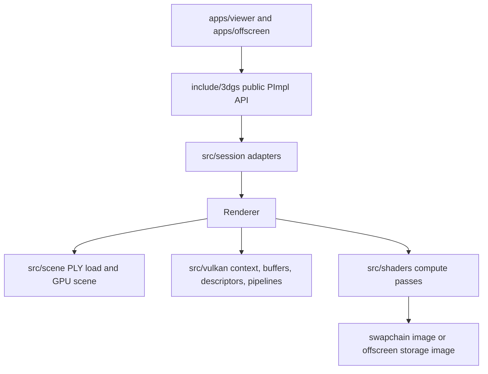

# Architecture

3DGS.cpp is organized as a small public C++ API over a Vulkan compute renderer.
The renderer does not use the graphics rasterizer for splats. Instead, it runs
covariance preparation, preprocessing, prefix sums, radix sorting, tile range
construction, and image compositing as compute work.

## Runtime Shape

The public API is intentionally narrow:

- [`vkgs::OffscreenRenderer`](../include/3dgs/OffscreenRenderer.hpp) owns a
  headless renderer, renders individual camera poses, and returns RGBA pixels.
- [`vkgs::viewer::Viewer`](../include/3dgs/Viewer.hpp) owns the interactive
  viewer frontend through a `WindowAdapter`.
- [`vkgs::Extent2D`, `CameraPose`, and `CameraProjection`](../include/3dgs/Types.hpp)
  are the stable data types shared by both frontends.

The public classes use PImpl wrappers. Their implementations delegate to
[`OffscreenSession`](../src/session/OffscreenSession.cpp) or
[`ViewerSession`](../src/session/ViewerSession.cpp), which convert public config
objects into [`vkgs::render::RendererConfiguration`](../src/render/RendererConfiguration.hpp).
Both session types own a single `Renderer`.

## Renderer Responsibilities

[`Renderer`](../src/Renderer.cpp) is the central orchestration object. It owns:

- the selected Vulkan context, queues, descriptor pool, and timestamp query
  manager;
- frontend output state, either a swapchain for the viewer or an offscreen
  storage image target;
- the uploaded Gaussian scene;
- compute pipelines for every forward-rendering pass;
- GPU buffers used for uniforms, projected vertex attributes, overlap counts,
  prefix sums, sort keys and payloads, histograms, and tile boundaries;
- command buffers for the scene-dependent preprocess work and the per-frame
  render work.

Initialization follows the order in `Renderer::initialize()`:

1. Create the Vulkan instance, physical device, logical device, queues, output
   target, and fences.
2. Create optional ImGui/ImPlot UI state for the viewer build.
3. Load the trained PLY scene and upload it to GPU buffers.
4. Build compute pipelines and descriptor sets.
5. Record the scene-dependent preprocess command buffer.

Frame rendering then updates camera uniforms, submits the preprocess command
buffer, records a render command buffer for the current output image, submits it,
and either presents the swapchain image or leaves the offscreen image ready for
readback.

## Scene Data

Scene loading starts in [`PlyReader`](../src/scene/PlyReader.cpp). It validates
that the input file is a binary little-endian trained 3DGS PLY with exactly the
expected 62 float vertex properties. CPU conversion performs the render-space
transforms used by the GPU:

- `scale_*` values are exponentiated into positive scale.
- `opacity` is converted with a sigmoid into `[0, 1]`.
- quaternions are normalized and rejected if zero length.
- PLY spherical harmonics are rearranged from the training file order into
  coefficient-major RGB storage.

The converted vertices are stored as
[`vkgs::render::SceneVertex`](../src/render/GpuTypes.hpp). `GpuScene::upload()`
creates the vertex storage buffer and runs the one-time covariance precompute
shader to fill the packed 3D covariance buffer.

## Vulkan Layer

The Vulkan code is split into focused helpers:

- [`VulkanContext`](../src/vulkan/VulkanContext.cpp) creates the instance,
  selects a device, validates required features, owns queues, and exposes
  one-time command buffer helpers.
- [`Buffer`](../src/vulkan/Buffer.cpp) wraps VMA allocation, upload, readback,
  reallocation, and common memory barriers.
- [`DescriptorSet`](../src/vulkan/DescriptorSet.cpp), [`Shader`](../src/vulkan/Shader.cpp),
  and [`ComputePipeline`](../src/vulkan/pipelines/ComputePipeline.cpp) keep
  descriptor and pipeline setup out of `Renderer`.
- [`BarrierBuilder`](../src/vulkan/BarrierBuilder.hpp) centralizes explicit
  buffer barriers that span more than one helper call.

The renderer currently requires Vulkan 1.2-capable compute support. The fast
sort path additionally needs `shaderInt64`, shared 64-bit atomics, storage-image
writes without format qualifiers, and subgroup operations with subgroup size 32.
A portable sort shader is selected on devices that do not expose the fast
subgroup path but still satisfy the rest of the required feature set.

## Shader Build

Shader sources live under [`src/shaders`](../src/shaders). CMake compiles them
with `glslangValidator`, then [`tools/embed_shaders.py`](../tools/embed_shaders.py)
packs the SPIR-V modules into a generated `shaders.hpp` header. Runtime shader
objects load these embedded byte arrays, so deployed binaries do not need loose
shader files.

[`src/shaders/shared_constants.glsl`](../src/shaders/shared_constants.glsl) is
included by both GLSL and C++ through [`GpuConstants.hpp`](../src/GpuConstants.hpp).
This keeps tile size, workgroup size, SH coefficient count, and radix-sort
configuration synchronized across dispatch code and shader code.

## Tests

The tests cover both CPU-only contracts and Vulkan integration behavior:

- ABI layout tests duplicate the static assertions in `GpuTypes.hpp`.
- PLY parser tests exercise accepted and rejected scene headers.
- pass-sizing tests protect dispatch and buffer-size arithmetic.
- render job and output filename tests cover offscreen app behavior.
- Vulkan tests cover device requirements, buffers, queries, sorting, and a
  golden-image render path when a suitable GPU is available.

Docs should treat these tests as executable documentation for invariants that
must remain true when the rendering pipeline evolves.

