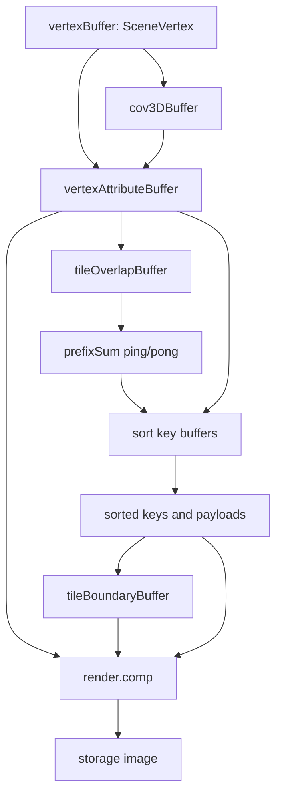

# Rendering Pipeline

The renderer turns a trained Gaussian Splatting PLY into pixels through a fixed
compute-pass sequence. The CPU side owns scene loading, pipeline setup, command
buffer submission, and output readback. The GPU side owns all splat projection,
sorting, tile binning, and per-pixel compositing.

## Pass Sequence


## 1. PLY Decode

[`PlyReader`](../src/scene/PlyReader.cpp) accepts trained 3DGS PLY files only.
The vertex layout must match the training output: positions, normal placeholders,
DC SH coefficients, remaining SH coefficients, opacity, scale, and rotation.

For each vertex, CPU conversion writes a
[`SceneVertex`](../src/render/GpuTypes.hpp) with:

- `position`: homogeneous world position.
- `scaleOpacity.xyz`: positive axis scales after `exp(scale_*)`.
- `scaleOpacity.w`: opacity after sigmoid.
- `rotation`: normalized quaternion in `[w, x, y, z]` order.
- `shs`: 16 RGB spherical-harmonic coefficient vectors.

The reader also computes a simple axis-aligned scene bound used to frame the
viewer camera.

## 2. GPU Scene Upload And Covariance Precompute

[`GpuScene::upload()`](../src/scene/GpuScene.cpp) creates a storage buffer for
all converted vertices and uploads it once. It then calls `precomputeCov3D()`,
which creates a packed covariance buffer and dispatches
[`precomp_cov3d.comp`](../src/shaders/precomp_cov3d.comp).

The covariance pass is scene-dependent, not camera-dependent. It converts each
Gaussian scale and rotation into the packed upper-right 3D covariance form:

```text
[ xx xy xz yy yz zz ]
```

Later passes read this buffer instead of rebuilding object-space covariance
every frame.

## 3. Camera Uniforms

Each draw updates a [`UniformBuffer`](../src/render/GpuTypes.hpp) with:

- camera position;
- view matrix;
- combined projection-view matrix, stored in the `projection` field;
- output width and height;
- horizontal and vertical tangent FOV values;
- near plane.

The CPU computes `tanFovX` from the configured horizontal FOV, derives
`tanFovY` from image aspect ratio, and uses GLM perspective math. The shader
uses these values for projection, culling, and the covariance projection
Jacobian.

## 4. Per-Splat Preprocess

[`preprocess.comp`](../src/shaders/preprocess.comp) runs one invocation per
Gaussian. It writes two outputs:

- `VertexAttribute[]`: projected splat state needed by later passes.
- `tiles_overlap[]`: the number of screen tiles touched by each visible splat.

The pass rejects splats behind the near plane, splats with invalid homogeneous
projection, splats with non-positive projected covariance determinant, and
splats whose 3-sigma screen bound touches no tile. Visible splats receive:

- conic coefficients from the inverse 2D covariance;
- opacity;
- SH-evaluated RGB color;
- screen-space center;
- radius in pixels;
- tile-space AABB;
- positive view-space depth.

## 5. Prefix Sum

The renderer copies `tiles_overlap[]` into the prefix-sum ping buffer and
dispatches [`prefix_sum.comp`](../src/shaders/prefix_sum.comp) for the number of
iterations returned by `prefixSumIterations(vertexCount)`. The shader performs
an inclusive scan over per-splat tile counts using ping/pong storage buffers.

The final scan value is copied to a host-visible staging buffer. That value is
the total number of splat-tile instances that must fit in the sort buffers. If
the current sort capacity is too small, `Renderer::recordRenderCommandBuffer()`
reallocates the key, payload, and histogram buffers, records the preprocess
command buffer again, and retries the frame.

## 6. Instance Expansion And Radix Sort

[`preprocess_sort.comp`](../src/shaders/preprocess_sort.comp) expands each
visible splat into one item per overlapped tile. For every tile in the splat's
AABB, it writes:

- key: high 32 bits are the linear tile index, low 32 bits are the float bit
  pattern of positive view-space depth;
- payload: source Gaussian index.

The radix sort then runs eight 8-bit passes over the 64-bit key:

1. [`sort/hist.comp`](../src/shaders/sort/hist.comp) builds per-workgroup
   histograms for the current byte.
2. [`sort/sort.comp`](../src/shaders/sort/sort.comp) or
   [`sort/sort_portable.comp`](../src/shaders/sort/sort_portable.comp) scatters
   keys and payloads into the opposite ping/pong buffer.

Because the key is 64 bits and there are eight passes, the final sorted key and
payload arrays are in the even buffers.

## 7. Tile Boundaries

Before boundary construction, the tile-boundary buffer is cleared to zero.
[`tile_boundary.comp`](../src/shaders/tile_boundary.comp) scans the sorted key
array and writes a `[start, end)` instance range for every tile that has sorted
items. Empty tiles remain `[0, 0)`.

This makes the final render pass tile-local: each workgroup reads only the
sorted instances for its screen tile.

## 8. Tiled Compositing

[`render.comp`](../src/shaders/render.comp) dispatches one workgroup per tile
and one invocation per pixel in the tile. Each invocation:

1. Reads the tile's `[start, end)` range.
2. Iterates sorted splat payloads in front-to-back order.
3. Evaluates the conic Gaussian at the pixel.
4. Converts opacity and Gaussian falloff into alpha.
5. Accumulates color using transmittance.
6. Stops early when transmittance is almost zero.
7. Writes `vec4(color, 1.0)` into the output storage image.

The output image is either transitioned for presentation in the viewer build or
left in a layout suitable for offscreen readback.

## Buffer Lifecycle



The project currently uses one frame in flight. Synchronization is still explicit
because compute passes reuse buffers across command buffers and need visibility
between shader writes, transfer reads/writes, and later shader reads.

