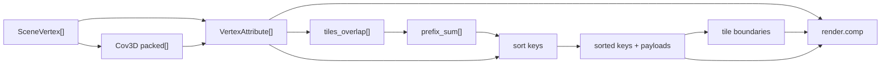

# Shader Notes

The renderer's splat rasterization is implemented as compute shaders under
[`src/shaders`](../../src/shaders). This folder documents each pass and the data
that moves between them.

## Pass Map

| Pass | Shader | Role |
| --- | --- | --- |
| 3D covariance | [`precomp_cov3d.comp`](../../src/shaders/precomp_cov3d.comp) | Converts scale and rotation into packed object-space covariance. |
| Preprocess | [`preprocess.comp`](../../src/shaders/preprocess.comp) | Projects splats, evaluates SH color, computes conic opacity and tile overlap counts. |
| Prefix sum | [`prefix_sum.comp`](../../src/shaders/prefix_sum.comp) | Inclusive scan over per-splat tile overlap counts. |
| Expansion | [`preprocess_sort.comp`](../../src/shaders/preprocess_sort.comp) | Emits one tile/depth key and Gaussian payload per splat-tile overlap. |
| Radix histogram | [`sort/hist.comp`](../../src/shaders/sort/hist.comp) | Builds 8-bit histograms for the current key byte. |
| Radix scatter | [`sort/sort.comp`](../../src/shaders/sort/sort.comp) or [`sort/sort_portable.comp`](../../src/shaders/sort/sort_portable.comp) | Sorts 64-bit keys and payloads over eight passes. |
| Tile boundaries | [`tile_boundary.comp`](../../src/shaders/tile_boundary.comp) | Converts sorted tile keys into per-tile `[start, end)` ranges. |
| Render | [`render.comp`](../../src/shaders/render.comp) | Evaluates visible splats per pixel and writes the output image. |

## Buffer Flow

## Pages

- [Shared ABI](shared-abi.md)
- [Covariance Precompute](precomp-cov3d.md)
- [Preprocess](preprocess.md)
- [Prefix Sum](prefix-sum.md)
- [Sort And Binning](sort-and-binning.md)
- [Render](render.md)

