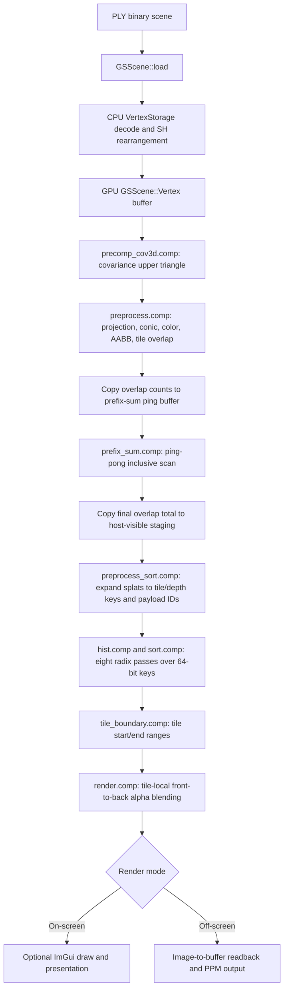
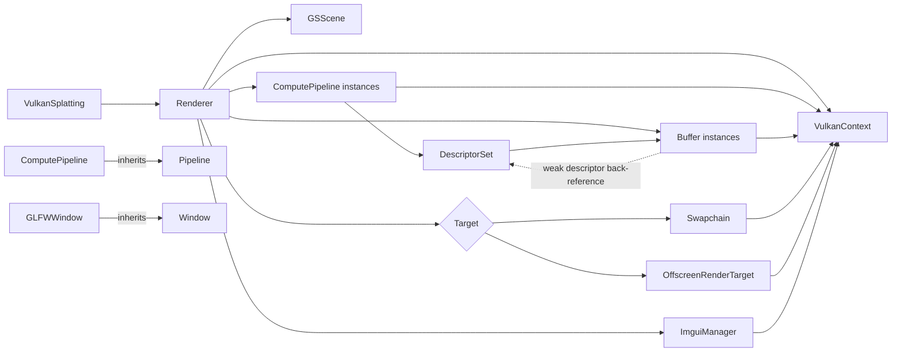

# 3DGS Vulkan Source and Graphics Revision Audit

Date: 2026-05-30

## 1. Executive Summary

The repository has a working Windows-first Vulkan Gaussian-splatting renderer with separate on-screen and off-screen application paths. The current Windows MSVC Debug presets build successfully, and a stable `build/compile_commands.json` exists. The renderer is not ready for a reliable OHOS/BiSheng Clang port yet because several latent correctness defects are masked when graphics and compute operations happen to use the same queue family and when the desktop GPU satisfies unstated shader assumptions.

The first revision wave should not be a mechanical style pass. It should establish and enforce the contracts that cross CPU, Vulkan, and GLSL boundaries:

- Queue-family selection, command-pool compatibility, and transfer barriers.
- Scene-count validation, byte-size arithmetic, and mapped-buffer transfer semantics.
- Explicit CPU/GLSL ABI assertions.
- Device capability checks for storage images, 64-bit shader operations, atomics, and subgroup behavior.
- Single-source configuration for tile, workgroup, radix-sort, and spherical-harmonic constants.

After correctness is stable, a second pass can improve type discipline, header hygiene, braces, `const`/`constexpr` usage, RAII, and class boundaries. Renderer decomposition and performance work should remain optional until validation tests exist.

### Baseline Verification

The following commands were run against the current working tree:

| Command | Result |
| --- | --- |
| `git status --short` | Existing dirty tree captured before analysis. |
| `cmake --list-presets` | Windows MSVC on-screen/off-screen Debug and Release presets plus OHOS arm64 Debug and Release presets are registered. |
| `cmake --build --preset windows-msvc-offscreen-debug` | Passed: `ninja: no work to do.` |
| `cmake --build --preset windows-msvc-onscreen-debug` | Passed: `ninja: no work to do.` |
| `Test-Path build/compile_commands.json` | Passed. A stable compilation database exists. |
| `Test-Path Env:OHOS_SDK_NATIVE` | Failed: the OHOS SDK environment variable is not available in this environment. |

The successful desktop builds do not invalidate the findings below. Several defects are conditional on runtime data, queue-family topology, or target GPU capabilities.

## 2. Architecture and Frame Pipeline

### Public API and Applications

`VulkanSplatting` is the public facade in `include/3dgs/3dgs.h:13`. It stores a `RendererConfiguration`, creates a `Renderer`, and exposes initialization, camera updates, drawing, readback, and shutdown through `src/3dgs.cpp:13-58`.

There are two application modes:

- On-screen: `apps/viewer/main.cpp:44-78` constructs a GLFW window and calls `VulkanSplatting::start()`.
- Off-screen: `apps/offscreen/main.cpp:192-231` loads JSON configuration, initializes once, updates camera state per frame, calls `draw()`, reads pixels, and writes PPM images.

### Initialization Path

`Renderer::initialize()` orchestrates the setup order at `src/Renderer.cpp:19-30`:

1. Create the Vulkan context and target.
2. Create optional GUI resources.
3. Load the scene and precompute covariance data.
4. Build preprocess, prefix-sum, radix-sort, key-expansion, tile-boundary, and rendering pipelines.
5. Create the renderer command pool.
6. Record the reusable preprocess command buffer.

### Frame Pipeline

### Scene Representation

`GSScene::load()` reads a binary PLY payload into the local `VertexStorage` structure at `src/GSScene.cpp:17-24`, transforms scale and opacity, normalizes the quaternion, rearranges the spherical-harmonic coefficients, uploads `GSScene::Vertex`, and dispatches `precomp_cov3d.comp`.

The runtime scene is represented primarily by:

- `GSScene::vertexBuffer`: position, scale/opacity, quaternion, and SH coefficients.
- `GSScene::cov3DBuffer`: six floats per splat for the symmetric covariance upper triangle.
- `Renderer::vertexAttributeBuffer`: projected conic, color/radius, tile AABB, UV, depth, and a debug marker.
- Prefix-sum buffers: tile-overlap counts and inclusive sums.
- Sort buffers: 64-bit tile/depth keys and 32-bit vertex payload IDs.
- Tile-boundary buffer: two 32-bit indices per tile.

### Vulkan Layer

The Vulkan layer consists of:

- `VulkanContext`: instance, physical/logical device, queues, descriptor pool, query pool, VMA allocator, and one-time submissions.
- `Buffer`: VMA-backed buffers, staging transfers, reallocation, and descriptor back-references.
- `DescriptorSet`: layouts, alternative bindings, descriptor allocation, and updates.
- `Pipeline` / `ComputePipeline`: compute pipeline layouts, descriptor binding, and push constants.
- `Swapchain`: on-screen images, views, and acquire semaphores.
- `OffscreenRenderTarget`: one storage image with transfer-source usage.
- `ImguiManager`: desktop GUI integration and dynamic rendering.

### Ownership and Inheritance

The weak backlink from `Buffer` to `DescriptorSet` avoids a direct reference cycle. The design still uses `shared_ptr` for many relationships that appear to have a single owner; this is a maintainability concern, not an immediate correctness defect.

## 3. Scene Representation and CPU/GPU Contracts

The following contracts are implicit today and should become explicit with `static_assert`, `offsetof`, and named configuration constants.

| Contract | C++ evidence | GLSL evidence | Expected layout | Required action |
| --- | --- | --- | --- | --- |
| Scene vertex | `src/GSScene.h:41-46` | `src/shaders/common.glsl:35-40` | Three `vec4` values plus 48 floats, expected 240 bytes | Assert size, alignment, and member offsets. Replace literal `48` with one shared SH constant. |
| Projected vertex attribute | `src/Renderer.h:35-42` | `src/shaders/common.glsl:42-49` | Two `vec4`, one `uvec4`, one `vec2`, one float, one 32-bit marker, expected 64 bytes | Rename the C++ padding field to reflect the GLSL marker contract and assert offsets. |
| Uniform block | `src/Renderer.h:25-33` | `src/shaders/preprocess.comp:14-22` | `std140`: `vec4`, two `mat4`, two `uint`, two floats, expected 160 bytes with current GLM defaults | Assert size and offsets under both MSVC and BiSheng Clang. |
| Radix push constants | `src/Renderer.h:56-61` | `src/shaders/sort/hist.comp:51-56`, `src/shaders/sort/sort.comp:56-61` | Four 32-bit unsigned values, expected 16 bytes | Assert size and use a shared named radix configuration. |
| Covariance buffer | `src/GSScene.cpp:152`, `src/shaders/precomp_cov3d.comp:42-47` | Six packed floats per splat | 24 bytes per splat | Define a named component count and assert CPU-side multiplication. |
| Sort key | `src/Renderer.cpp:284-287` | `src/shaders/preprocess_sort.comp:49-55` | Upper 32 bits: tile index. Lower 32 bits: positive view-space depth bit pattern. | Document positivity requirement and validate tile-count bounds before key generation. |
| Tile boundaries | `src/Renderer.cpp:368-370`, `src/Renderer.cpp:739-755` | `src/shaders/tile_boundary.comp:28-49`, `src/shaders/render.comp:41-44` | Two `uint32_t` values per tile: inclusive start, exclusive end | Keep zero-fill behavior but test tile zero, empty tiles, and the final tile. |

### Descriptor Contract by Stage

| Stage | Inputs | Outputs |
| --- | --- | --- |
| Covariance precompute | Scene vertex buffer | Covariance float buffer |
| Preprocess | Scene vertex buffer, covariance buffer, uniform block | Projected attributes, tile-overlap counts |
| Prefix sum | Ping buffer, pong buffer | Inclusive tile-overlap sum |
| Sort-key expansion | Projected attributes, selected prefix-sum buffer | 64-bit keys, 32-bit payload IDs |
| Radix histogram | Selected key buffer | Histogram buffer |
| Radix scatter | Selected key/payload inputs, histogram buffer | Alternate key/payload outputs |
| Tile boundaries | Sorted key buffer | Tile boundary pairs |
| Render | Projected attributes, boundaries, sorted payload IDs | Storage image |

## 4. Priority-Ordered Findings

### P0 Critical

#### VKGS-001: One-time command buffers can be submitted to the wrong queue family

- Classification: verified conditional defect
- Category: Vulkan queue-family correctness
- Evidence: `src/vulkan/VulkanContext.cpp:249-268` allocates every one-time command buffer from `commandPool`; `src/vulkan/VulkanContext.cpp:280-286` creates that pool for `graphicsFamily`; callers submit many of those buffers to `Queue::COMPUTE`, including `src/GSScene.cpp:168-175`, `src/vulkan/Buffer.cpp:66-70`, and `src/vulkan/OffscreenRenderTarget.cpp:37-49`.
- Impact: Vulkan command buffers must be submitted to a queue from the family used to create their command pool. The current code is invalid when graphics and compute families differ. A desktop GPU with one shared family masks the defect.
- Recommended fix direction: maintain one transient pool per queue family or require the submission queue at allocation time. Add a queue policy that explicitly chooses a graphics-capable compute queue for the on-screen path when GUI commands are recorded into the render command buffer.
- Dependencies and contracts: affects staging transfers, covariance precompute, off-screen target transitions, readback, query reset, and future split-queue synchronization.
- Validation: enable Vulkan validation layers on a device exposing separate graphics and compute families; execute scene load, draw, readback, and resize.
- Behavior change: no intended visual change; broader device support.

#### VKGS-002: Preprocess buffer barriers use compute access masks around transfer operations

- Classification: verified defect
- Category: Vulkan synchronization
- Evidence: `src/Renderer.cpp:604-610` performs compute writes, calls `computeWriteReadBarrier()`, then copies tile-overlap data with `copyBuffer()`, and calls another compute-to-compute barrier before prefix-sum reads. `src/vulkan/Buffer.cpp:184-203` hardcodes compute shader stages and shader access masks. The final sum copy at `src/Renderer.cpp:633-640` also lacks an explicit compute-write to transfer-read dependency. A correct transfer-to-compute pattern already exists for tile-boundary zero fill at `src/Renderer.cpp:739-745`.
- Impact: the required compute-write to transfer-read and transfer-write to compute-read dependencies are not expressed. Results can be stale or undefined depending on driver scheduling.
- Recommended fix direction: add explicit barrier helpers parameterized by source/destination stage and access flags, or use narrowly named helpers for compute-to-transfer, transfer-to-compute, and compute-to-host-copy transitions. Prefer synchronization2 if the supported Vulkan baseline allows it.
- Dependencies and contracts: affects tile-overlap copy, prefix sum, host total readback, and any reusable buffer helper API.
- Validation: run validation layers and compare total instance counts and rendered hashes across repeated runs and multiple vendors.
- Behavior change: fixes nondeterministic behavior.

#### VKGS-003: Swapchain sharing uses queue type enum values instead of queue-family indices

- Classification: verified conditional defect
- Category: Vulkan swapchain correctness
- Evidence: `src/vulkan/Swapchain.cpp:74-85` iterates `context->queues` but appends `queue.first`. The map key is `VulkanContext::Queue::Type` (`GRAPHICS`, `COMPUTE`, `PRESENT`) from `src/vulkan/VulkanContext.h:40-47`; the required values are `queue.second.queueFamily`.
- Impact: the swapchain can be created with invalid or unrelated queue-family indices. This is especially likely to fail on a platform with separate presentation, graphics, and compute families.
- Recommended fix direction: build a deduplicated set of actual family indices from `queue.second.queueFamily`. Decide whether on-screen rendering intentionally uses concurrent sharing or explicit ownership transfers.
- Dependencies and contracts: must be resolved together with VKGS-001 and VKGS-004.
- Validation: run validation layers on split-family hardware and exercise acquire, render, GUI, present, and recreate.
- Behavior change: no intended visual change.

#### VKGS-004: The on-screen render command buffer assumes a compute queue can execute GUI graphics work

- Classification: verified conditional defect
- Category: queue policy and on-screen rendering
- Evidence: render submission targets `Queue::COMPUTE` at `src/Renderer.cpp:464`. When GUI is enabled, `src/Renderer.cpp:812-824` appends ImGui dynamic-rendering commands to that same command buffer. `ImguiManager` itself configures a graphics queue at `src/vulkan/ImguiManager.cpp:120-127`.
- Impact: a dedicated compute-only queue cannot execute graphics rendering commands. The current implementation works only if the selected compute queue family also supports graphics.
- Recommended fix direction: make the on-screen queue policy explicit. The conservative first revision is to record and submit the complete on-screen command buffer on a graphics-capable family that also supports compute. A later optimization may split compute and GUI submissions with semaphores and image ownership transitions.
- Dependencies and contracts: queue selection, command pools, swapchain sharing, presentation, and resize.
- Validation: select a device with a dedicated compute family and verify both GUI-enabled and GUI-disabled on-screen modes.
- Behavior change: no intended visual change; queue selection can affect performance.

### P1 High

#### VKGS-005: Empty scenes underflow preprocessing calculations

- Classification: verified defect
- Category: input validation and bounds
- Evidence: `src/Renderer.cpp:618` computes `log2(scene->getNumVertices())`; `src/Renderer.cpp:633` copies from `(scene->getNumVertices() - 1) * sizeof(uint32_t)`. Zero vertices underflow the copy offset and make the logarithm invalid. Zero-sized scene buffers are also allocated earlier.
- Impact: an empty or malformed PLY can trigger undefined arithmetic, invalid buffer operations, or allocation failures.
- Recommended fix direction: reject zero-vertex scenes during PLY validation unless empty scenes become a supported rendering contract. If supported, short-circuit preprocessing and render a cleared target.
- Dependencies and contracts: scene parser, dispatch sizing, prefix sum, off-screen image output.
- Validation: add explicit zero-vertex and one-vertex tests.
- Behavior change: malformed input receives a deterministic error, or empty scenes become defined.

#### VKGS-006: Buffer transfer offsets are ignored or applied to the wrong side

- Classification: verified defect
- Category: reusable buffer API
- Evidence: `Buffer::downloadTo()` accepts `srcOffset` and `dstOffset` at `src/vulkan/Buffer.cpp:96` but never applies them in either branch at `src/vulkan/Buffer.cpp:99-104`. `Buffer::upload()` accepts one `offset` at `src/vulkan/Buffer.cpp:58` and applies it to the source pointer at `src/vulkan/Buffer.cpp:65` and `src/vulkan/Buffer.cpp:72`, while the Vulkan destination offset remains zero.
- Impact: `Buffer::readOne(offset)` is incorrect for GPU-only buffers because it relies on `downloadTo(stagingBuffer, offset, 0)` at `src/vulkan/Buffer.h:53-57`. Future partial uploads and downloads silently copy the wrong bytes.
- Recommended fix direction: replace ambiguous methods with explicit source offset, destination offset, and byte-count parameters using `vk::DeviceSize`; validate both source and destination ranges. Consider `std::span<const std::byte>` for host uploads.
- Dependencies and contracts: staging transfers, readback helpers, buffer tests.
- Validation: upload and download nonzero subranges and test first, middle, and final elements.
- Behavior change: corrects partial-transfer semantics.

#### VKGS-007: PLY header and payload parsing are not robust enough for untrusted or variant files

- Classification: verified defect
- Category: scene ingestion
- Evidence:
  - `PlyHeader::numVertices` and `numFaces` are uninitialized at `src/GSScene.h:16-21`.
  - Property routing compares property count with vertex count at `src/GSScene.cpp:125-133`, rather than tracking the active `element`.
  - Payload reads deserialize directly into `VertexStorage` at `src/GSScene.cpp:37-41`.
  - Runtime payload checks are `assert`-only and occur before the read at `src/GSScene.cpp:38-41`; they disappear in Release and do not detect a short final read.
- Impact: malformed headers, reordered properties, alternate PLY element sections, truncated data, packing differences, or endian differences can corrupt scene data or cause oversized allocations.
- Recommended fix direction: validate the exact supported schema by property name, type, order, element, format, count range, and binary endianness. Initialize header fields, check stream state after every payload read, and report contextual errors. If flexible schemas are required, parse fields explicitly instead of deserializing a native struct.
- Dependencies and contracts: scene-count type policy, SH ordering, quaternion ordering, binary compatibility.
- Validation: add fixtures for valid input, zero vertices, missing header values, wrong property order, extra face properties, wrong format, and truncated payloads.
- Behavior change: unsupported PLY variants fail clearly instead of being misread.

#### VKGS-008: Physical-device suitability does not validate requested features or queue completeness

- Classification: verified defect and portability risk
- Category: Vulkan capability negotiation
- Evidence:
  - `src/vulkan/VulkanContext.cpp:86-110` reads properties and features but validates only extensions and surface format/present-mode availability.
  - Explicit device selection bypasses suitability checks at `src/vulkan/VulkanContext.cpp:130-136`.
  - Automatic selection indexes `suitableDevices[0]` without checking emptiness at `src/vulkan/VulkanContext.cpp:139-147`.
  - Logical-device creation requests storage-image writes, shader `int64`, and 64-bit atomics at `src/Renderer.cpp:141-151`, forces anisotropy at `src/vulkan/VulkanContext.cpp:208`, and consumes optional queue indices with `.value()` at `src/vulkan/VulkanContext.cpp:196-200`.
- Impact: startup can fail with unclear errors or undefined indexing on OHOS and lower-capability GPUs. A manually selected device can bypass checks entirely.
- Recommended fix direction: define a renderer capability profile and validate API version, queue families, requested extensions, requested core features, Vulkan 1.2 features, subgroup properties, timestamp support, storage image support, and swapchain usage support before selection.
- Dependencies and contracts: shader requirements, off-screen format, swapchain mode, diagnostics.
- Validation: test automatic and explicit selection against supported and unsupported devices or mocked capability records.
- Behavior change: unsupported devices receive deterministic diagnostics.

#### VKGS-009: Radix sorting hardcodes subgroup size 32

- Classification: portability risk requiring runtime validation
- Category: GPU algorithm assumptions
- Evidence: `src/shaders/sort/sort.comp:36-44` enables subgroup operations and defines `SUBGROUP_SIZE 32` with a comment noting AMD size 64. The shader sizes shared arrays and indexes subgroup results based on that constant at `src/shaders/sort/sort.comp:84-123`.
- Impact: sorting can produce incorrect results or access invalid shared-array entries when subgroup size differs. Mobile GPUs targeted by OHOS require explicit validation.
- Recommended fix direction: query subgroup capabilities and supported sizes. Either specialize the shader per supported subgroup size, use subgroup-size control when available and validated, or rewrite the reduction to use runtime-safe subgroup logic.
- Dependencies and contracts: device suitability, shader compilation variants, radix-sort tests.
- Validation: GPU sort tests with random, ordered, duplicate, and boundary-size key sets on every target GPU family.
- Behavior change: broader GPU compatibility; algorithm implementation may change.

#### VKGS-010: Embedded SPIR-V arrays do not guarantee four-byte alignment

- Classification: verified portability risk
- Category: shader module creation
- Evidence: `tools/embed_shaders.py:39-46` emits `static constexpr unsigned char` arrays without `alignas(4)`. `src/vulkan/Shader.cpp:13-18` reinterprets byte pointers as `const uint32_t*`. The runtime-file fallback also reinterprets storage from `std::vector<char>`.
- Impact: `vkCreateShaderModule` requires a suitably aligned `pCode`. The current representation relies on incidental alignment and can fail or invoke undefined behavior on stricter compilers and architectures.
- Recommended fix direction: emit `alignas(4) static constexpr std::uint32_t[]` or an aligned byte array with validated size multiple of four. Load runtime SPIR-V into aligned 32-bit storage and validate the file length.
- Dependencies and contracts: embed script, generated header, `Shader` constructors.
- Validation: compile and create all shader modules under MSVC, desktop Clang, and BiSheng Clang with alignment sanitization where available.
- Behavior change: no shader behavior change.

#### VKGS-011: CPU/GLSL layouts are implicit and compiler-sensitive

- Classification: portability risk
- Category: ABI contract
- Evidence: mirrored structures exist at `src/GSScene.h:41-46`, `src/Renderer.h:25-42`, and `src/Renderer.h:56-61`, with GLSL counterparts at `src/shaders/common.glsl:35-49`, `src/shaders/preprocess.comp:14-22`, and `src/shaders/sort/sort.comp:56-61`. No CPU-side size or offset assertions protect them.
- Impact: compiler options, GLM alignment configuration, or refactors can silently break GPU reads. The risk increases when moving from MSVC to BiSheng Clang.
- Recommended fix direction: centralize CPU-side GPU contract structures, use explicit fixed-width fields, and add size/alignment/offset assertions. Generate or share constants where practical.
- Dependencies and contracts: GLM configuration, shader constants, public/internal header organization.
- Validation: compile-time assertions in every supported preset plus one GPU smoke image.
- Behavior change: no intended behavior change.

#### VKGS-012: Buffer reallocation writes an allocation-relative offset into descriptors

- Classification: verified conditional defect
- Category: descriptor updates
- Evidence: initial descriptor bindings use offset zero at `src/vulkan/DescriptorSet.cpp:13-14`. After reallocation, `src/vulkan/Buffer.cpp:121-133` updates descriptors with `vk::DescriptorBufferInfo(buffer, allocation_info.offset, size)`.
- Impact: descriptor buffer offsets are relative to the start of the `VkBuffer`, not the backing VMA allocation. Dedicated allocations often mask this because their allocation offset is zero.
- Recommended fix direction: keep descriptor offset zero unless the buffer API explicitly models subranges. Add a regression test that reallocates a descriptor-bound buffer.
- Dependencies and contracts: sort-buffer growth, VMA allocation policy, descriptor update tests.
- Validation: force sort-buffer growth and inspect validation output and rendered hashes.
- Behavior change: fixes latent descriptor corruption.

#### VKGS-013: Mapped staging memory relies on implicit coherence

- Classification: portability risk requiring validation
- Category: VMA memory synchronization
- Evidence: staging allocations request mapped host access at `src/vulkan/Buffer.cpp:148-152`. Upload and readback paths directly call `memcpy` or read mapped pointers at `src/vulkan/Buffer.cpp:65-72`, `src/vulkan/Buffer.cpp:103-104`, and `src/Renderer.cpp:532-535` without explicit VMA flush or invalidate calls.
- Impact: non-coherent host-visible memory can expose stale data on some devices.
- Recommended fix direction: confirm the selected memory types and use `vmaFlushAllocation` and `vmaInvalidateAllocation` where required. Encapsulate mapped reads and writes in `Buffer`.
- Dependencies and contracts: staging helper, readback, VMA memory usage selection.
- Validation: inspect selected memory properties and run upload/readback tests on non-coherent-capable hardware.
- Behavior change: no intended behavior change.

#### VKGS-014: Shader constants and numerical policy drift across CPU and GLSL

- Classification: verified maintainability issue with correctness impact
- Category: shader configuration
- Evidence:
  - Tiles are `16x16` in `src/shaders/common.glsl:1-2`, but CPU calculations repeat literal `16` at `src/Renderer.cpp:113-115`, `src/Renderer.cpp:368-370`, `src/Renderer.cpp:691`, and `src/Renderer.cpp:785`.
  - Workgroup size `256` is repeated in CPU dispatches and multiple shaders, including `src/GSScene.cpp:173`, `src/Renderer.cpp:595`, and `src/shaders/precomp_cov3d.comp:23`.
  - Radix configuration is split across `src/Renderer.cpp:706-715`, `src/Renderer.h:150`, and `src/shaders/sort/sort.comp:42-46`.
  - SH dimensions are split across `src/GSScene.cpp:51`, `src/shaders/common.glsl:3`, and `src/shaders/common.glsl:39`.
  - Camera near plane is configurable in `include/3dgs/3dgs.h:21-23`, but shader culling uses literal `0.2f` at `src/shaders/preprocess.comp:135`.
- Impact: configuration changes can compile successfully while CPU dispatch and GPU indexing disagree. Camera settings can disagree with culling behavior.
- Recommended fix direction: define a reviewed constant taxonomy. Generate build-time shared constants for ABI and hardware configuration; use uniforms or push constants for runtime camera policy; keep documented `constexpr` or GLSL constants for stable algorithm coefficients.
- Dependencies and contracts: CMake shader generation, CPU layout header, validation images.
- Validation: vary image extent, camera near plane, and tile configuration in dedicated tests.
- Behavior change: camera culling behavior should become consistent with configuration.

#### VKGS-015: Shader preprocessing has unguarded numerical edge cases and asymmetric color clamping

- Classification: verified defect and numerical-risk cluster
- Category: shader correctness
- Evidence:
  - Projection divides by `p_hom.w` before checking view-space depth at `src/shaders/preprocess.comp:130-136`.
  - SH direction normalization divides by `length(ray_direction)` at `src/shaders/preprocess.comp:76-78`.
  - Only `c.x` is clamped to zero at `src/shaders/preprocess.comp:100-104`; `c.y` and `c.z` remain negative.
  - Projection Jacobian calculations divide by `t.z` repeatedly at `src/shaders/preprocess.comp:34-48`.
- Impact: degenerate camera/splat positions can create NaN or infinity values. Negative green or blue output can propagate into image writes inconsistently with red.
- Recommended fix direction: define epsilon guards and invalid-splat early returns, clamp all color channels consistently, and add debug counters for rejected splats.
- Dependencies and contracts: image golden tests, camera validation, algorithm review.
- Validation: test splats at camera position, behind near plane, at extreme scale, and with negative SH output.
- Behavior change: edge-case pixels and invalid-splat handling may change.

#### VKGS-016: Readback byte arithmetic and render dimensions are not validated

- Classification: verified risk
- Category: input validation and arithmetic
- Evidence: `src/Renderer.cpp:496-499` computes `width * height * pixelSize` with 32-bit operands before allocating a staging buffer. `src/Renderer.cpp:842-846` divides by width and height during uniform updates. Off-screen JSON width and height are accepted without positive-range checks at `apps/offscreen/main.cpp:181-182`.
- Impact: zero dimensions cause invalid projection arithmetic; very large dimensions can overflow staging size and produce out-of-bounds reads or writes.
- Recommended fix direction: validate dimensions at API/config boundaries and perform byte arithmetic in `vk::DeviceSize` or checked `size_t`.
- Dependencies and contracts: off-screen JSON validation, swapchain minimize behavior, PPM output.
- Validation: reject zero dimensions and test checked overflow with intentionally excessive values.
- Behavior change: invalid dimensions fail early.

### P2 Medium

#### VKGS-017: Swapchain recreation leaks acquire semaphores and misses a preferred image-count optimization

- Classification: verified resource-lifetime issue and performance opportunity
- Category: swapchain lifecycle
- Evidence: `src/vulkan/Swapchain.cpp:118-124` clears images but not `imageAvailableSemaphores`, while `src/vulkan/Swapchain.cpp:113-115` appends semaphores during every recreation. `src/vulkan/Swapchain.cpp:58-63` requests `minImageCount + 1` but resets to `minImageCount` when `maxImageCount == 0`, even though zero means no maximum.
- Impact: repeated resize accumulates semaphores. Unlimited-capacity surfaces lose the intended extra image.
- Recommended fix direction: clear or resize acquire semaphores with recreated images, pass `oldSwapchain` during replacement, and retain `minImageCount + 1` when no maximum exists.
- Dependencies and contracts: resize tests, ImGui image-count update.
- Validation: resize repeatedly under validation layers and inspect resource counts.
- Behavior change: lower resource growth and potentially smoother presentation.

#### VKGS-018: ImGui swapchain counts and final transition need validation

- Classification: portability risk requiring runtime validation
- Category: GUI integration
- Evidence: `src/vulkan/ImguiManager.cpp:123-127` sets `MinImageCount = 2` and `ImageCount = swapchain->imageCount + 1` instead of using the actual swapchain image vector. The GUI-to-present transition at `src/Renderer.cpp:815-823` uses `eComputeShader` as destination stage after color output.
- Impact: GUI setup can disagree with the real swapchain. The final layout dependency is difficult to reason about and may trigger validation on stricter drivers.
- Recommended fix direction: initialize and update ImGui from actual swapchain image count; review the present transition with synchronization2 and resize handling.
- Dependencies and contracts: swapchain recreation, GUI backend lifecycle.
- Validation: GUI-enabled resize loop under validation layers.
- Behavior change: no intended visual change.

#### VKGS-019: GLFW resources have no RAII owner

- Classification: verified resource-lifetime issue
- Category: desktop windowing
- Evidence: `src/vulkan/windowing/GLFWWindow.cpp:6-13` initializes GLFW and creates a window. `src/vulkan/windowing/GLFWWindow.h:6-33` declares no destructor, and project-owned code contains no `glfwDestroyWindow` or `glfwTerminate` calls. Initialization and window creation return values are also not checked.
- Impact: desktop resources leak and startup failures can flow into null window usage.
- Recommended fix direction: introduce a GLFW lifetime owner, destroy each window, terminate GLFW at the correct shared-lifetime boundary, and validate required-extension retrieval.
- Dependencies and contracts: desktop-only API and multi-window policy.
- Validation: repeatedly construct and destroy the viewer in a process-level test.
- Behavior change: deterministic cleanup and clearer failures.

#### VKGS-020: Descriptor alternatives and index domains need bounds hardening

- Classification: maintainability issue with latent bounds risk
- Category: descriptors
- Evidence: `Pipeline::DescriptorOption::get()` indexes `values[index]` without checking at `src/vulkan/pipelines/Pipeline.cpp:5-10`. `DescriptorSet::getDescriptorSet()` checks option but not frame bounds at `src/vulkan/DescriptorSet.cpp:75-79`. Descriptor code mixes `uint8_t`, `uint32_t`, `int`, `auto`, and `size_t` at `src/vulkan/DescriptorSet.cpp:34-79`.
- Impact: a pipeline/descriptors mismatch can become an out-of-bounds read instead of a contextual error.
- Recommended fix direction: introduce explicit descriptor frame and option index types or consistently use `size_t` internally with checked narrowing at Vulkan boundaries. Validate option-vector cardinality before binding.
- Dependencies and contracts: pipeline binding API, resize-driven output image alternatives.
- Validation: unit-test valid and invalid descriptor option counts and indices.
- Behavior change: invalid bindings fail deterministically.

#### VKGS-021: Type domains are inconsistent across scene counts, byte sizes, and Vulkan widths

- Classification: maintainability issue with overflow risk
- Category: C++ type discipline
- Evidence:
  - `PlyHeader` stores counts as `int` at `src/GSScene.h:18-19`, while `getNumVertices()` returns `uint64_t` at `src/GSScene.h:37-39`.
  - A stale private declaration uses `unsigned long` at `src/GSScene.h:59`.
  - `Buffer` mixes `vk::DeviceSize`, `uint64_t`, and `uint32_t` for sizes at `src/vulkan/Buffer.h:29-49`.
  - `Renderer` stores `sortBufferSizeMultiplier` as `unsigned int` at `src/Renderer.h:155`.
  - The viewer narrows a parsed device index to `uint8_t` without range validation at `apps/viewer/main.cpp:57-59`; the off-screen app correctly validates first at `apps/offscreen/main.cpp:53-57`.
- Impact: negative PLY counts can become huge allocations, byte calculations narrow silently, and platform widths differ.
- Recommended fix direction: use validated unsigned scene counts, `vk::DeviceSize` for GPU bytes and offsets, `size_t` for host container indices, and `uint32_t` for Vulkan/GLSL wire values. Add checked narrowing helpers. Remove stale declarations.
- Dependencies and contracts: parser rewrite, buffer API, dispatch limit checks.
- Validation: compile with conversion warnings and add boundary tests.
- Behavior change: invalid values fail earlier.

#### VKGS-022: Control flow and dead debug blocks obscure frame behavior

- Classification: maintainability issue
- Category: C++ and GLSL clarity
- Evidence:
  - `src/Renderer.cpp:451-453` uses `goto` to restart preprocessing after sort-buffer growth.
  - `src/Renderer.cpp:98-99` and `src/GUIManager.cpp:18-23` contain unbraced control flow.
  - Empty or commented debug blocks remain in shaders, for example `src/shaders/render.comp:49-59`, `src/shaders/render.comp:72-74`, and `src/shaders/prefix_sum.comp:54-58`.
  - A stray standalone semicolon remains at `src/vulkan/pipelines/ComputePipeline.h:11-12`.
- Impact: restart semantics and shader intent are harder to review, while style enforcement remains inconsistent.
- Recommended fix direction: replace `goto` with a bounded loop or explicit retry result, require braces for every control-flow block, remove stale debug blocks, and retain only targeted instrumentation behind named debug helpers.
- Dependencies and contracts: no algorithm change required.
- Validation: clang-format, clang-tidy, and renderer smoke tests.
- Behavior change: none intended.

#### VKGS-023: Header dependencies are cyclic and rely on transitive includes

- Classification: maintainability issue
- Category: project structure and include hygiene
- Evidence: `src/vulkan/Buffer.h:4` includes `DescriptorSet.h` while forward-declaring `DescriptorSet`; `src/vulkan/DescriptorSet.h:4-6` includes `Buffer.h`, `Swapchain.h`, and `VulkanContext.h` while forward-declaring `Buffer`. `src/vulkan/Window.h:14-27` uses `std::array` and `std::pair` without directly including their headers.
- Impact: compile times grow, include order becomes fragile, and Clang-based ports can expose missing includes hidden by MSVC transitive behavior.
- Recommended fix direction: forward declare where possible, include complete definitions in `.cpp` files, and make every header self-contained.
- Dependencies and contracts: project structure cleanup only.
- Validation: compile each project-owned header in an isolated translation unit with BiSheng Clang or desktop Clang.
- Behavior change: none.

#### VKGS-024: Public API lifecycle guards are incomplete

- Classification: maintainability issue with runtime-risk edge cases
- Category: API design
- Evidence: camera setters guard against missing renderer at `src/3dgs.cpp:33-44`, but `draw()`, `readPixels()`, `logMovement()`, and `stop()` dereference renderer directly at `src/3dgs.cpp:25-30`, `src/3dgs.cpp:53-58`. On-screen `logTranslation()` dereferences `configuration.window` at `src/3dgs.cpp:47-50`.
- Impact: invalid call order produces null dereferences rather than contextual errors.
- Recommended fix direction: define and enforce a facade lifecycle state. Consider idempotent `stop()` and mode-aware errors for unsupported operations.
- Dependencies and contracts: public API behavior documentation.
- Validation: API state-machine unit tests.
- Behavior change: invalid sequences fail explicitly.

#### VKGS-025: Renderer owns too many responsibilities for safe iterative revision

- Classification: optional redesign
- Category: architecture
- Evidence: `Renderer` owns initialization, camera input, query metrics, scene upload, every compute stage, swapchain recreation, submissions, readback, and GUI orchestration across `src/Renderer.cpp:19-867`.
- Impact: correctness fixes in one stage can unintentionally affect another. Platform-specific policy is mixed with algorithm orchestration.
- Recommended fix direction: after Wave 3, consider extracting queue/submission policy, scene upload, GPU contract configuration, and frame-stage recording into focused components. Keep the first correctness waves local to avoid unnecessary churn.
- Dependencies and contracts: defer until regression tests exist.
- Validation: no architecture extraction before image and buffer tests pass.
- Behavior change: none intended.

### P3 Low / Quick Wins

#### VKGS-026: Query-pool sizing is a hidden fixed contract

- Classification: maintainability issue
- Category: instrumentation
- Evidence: query pool count is `20` at `src/vulkan/VulkanContext.cpp:185`, reset count is `12` at `src/vulkan/VulkanContext.cpp:189` and `src/Renderer.cpp:599`, while IDs are allocated dynamically through public `QueryManager::nextId` at `src/vulkan/QueryManager.h:16` and `src/vulkan/QueryManager.cpp:6-11`.
- Impact: adding metrics can exceed reset or pool capacity without a local compile-time failure.
- Recommended fix direction: centralize query capacity, encapsulate `nextId`, validate registration capacity, and reset the registered range.
- Dependencies and contracts: instrumentation only.
- Validation: register exactly capacity and capacity-plus-one queries.
- Behavior change: clearer errors.

#### VKGS-027: Several C++ declarations can be tightened without changing logic

- Classification: maintainability issue
- Category: C++20 cleanup
- Evidence: `Renderer::~Renderer() {}` at `src/Renderer.cpp:867` can be defaulted; `VulkanContext` has a virtual destructor without visible polymorphic use at `src/vulkan/VulkanContext.h:81`; several accessors can become `[[nodiscard]]`; unused variables and comments remain, including `severity` at `src/vulkan/VulkanContext.cpp:24`.
- Impact: noise obscures meaningful contracts.
- Recommended fix direction: perform a focused `const`/`constexpr`/`static`/`inline`/`[[nodiscard]]`/`noexcept` review after correctness fixes. Prefer anonymous-namespace helpers over file-global symbols where appropriate.
- Dependencies and contracts: style tooling.
- Validation: build and clang-tidy.
- Behavior change: none.

#### VKGS-028: Build configuration has a FetchContent quiet-variable spelling mismatch

- Classification: maintainability issue
- Category: build integration
- Evidence: `cmake/Dependencies.cmake:3` and `CMakePresets.json:16` use `FETCH_CONTENT_QUIET`; CMake's FetchContent cache option is conventionally `FETCHCONTENT_QUIET`.
- Impact: the intended verbose dependency-resolution policy may not take effect.
- Recommended fix direction: verify against the installed CMake 3.28 behavior and use the recognized variable consistently.
- Dependencies and contracts: build modernization only.
- Validation: configure from a clean build directory and inspect dependency-resolution output.
- Behavior change: configure logging only.

## 5. Cross-Platform Risks: Windows and OHOS

### Windows MSVC

The on-screen and off-screen Debug presets currently build. Windows remains the primary development baseline, but validation must include:

- A Vulkan validation-layer run for on-screen GUI enabled, on-screen GUI disabled, and off-screen rendering.
- Repeated swapchain resize and minimize/restore cycles.
- A scene that forces sort-buffer growth.
- A controlled buffer subrange upload/download test.
- A GPU sort correctness test independent of rendered output.

### OHOS / HarmonyOS with BiSheng Clang

The OHOS SDK was not available during this audit, so the OHOS presets could not be configured or built. Before claiming OHOS support, validate:

- The selected OHOS GPU exposes the required Vulkan version and storage-image format support.
- `shaderInt64`, shared 64-bit atomics, buffer 64-bit atomics, and required subgroup operations are available or removed through shader redesign.
- Subgroup size assumptions are eliminated or specialized for the target.
- All headers are self-contained under Clang.
- Native widths do not affect scene parsing, buffer sizes, or generated shader alignment.
- The off-screen core path remains independent of GLFW and ImGui.
- Host `glslangValidator` remains discoverable during cross-compilation.

The current code should treat OHOS as a capability-constrained target, not as a compiler-only port.

## 6. Recommended Revision Waves

### Wave 0: Establish Reproducible Baseline

1. Add small deterministic PLY fixtures and a GPU-independent parser test.
2. Add a Vulkan validation smoke command for both Windows Debug modes.
3. Add CPU/GPU contract compile-time assertions.
4. Add a GPU sort test that compares output with a CPU reference.
5. Record one off-screen golden image and one rendered hash for regression detection.
6. Configure Release presets and run them before logic changes.

### Wave 1: Correctness and Vulkan Contracts

1. Resolve VKGS-001 through VKGS-004 as one queue-policy change.
2. Replace the incorrect preprocess barriers in VKGS-002.
3. Reject or explicitly support empty scenes.
4. Correct `Buffer` partial-transfer semantics and descriptor reallocation offsets.
5. Add robust device suitability checks and contextual diagnostics.
6. Fix swapchain queue-family indices and recreation lifetime issues.

Acceptance criteria:

- Validation layers report no queue-family, command-pool, descriptor, layout, or synchronization errors in the Windows smoke matrix.
- Buffer subrange tests pass.
- Sort-buffer growth produces the same rendered result before and after reallocation.

### Wave 2: Type Discipline, ABI, Constants, and Parsing

1. Replace unvalidated scene counts and stale nonportable declarations with domain-specific types.
2. Standardize GPU byte sizes and offsets on `vk::DeviceSize`; retain `size_t` for host indexing and `uint32_t` for GLSL/Vulkan wire values.
3. Add checked arithmetic and checked narrowing.
4. Harden the supported PLY schema and error messages.
5. Move shared shader configuration into a generated or reviewed contract source.
6. Pass camera near-plane policy to the shader rather than duplicating a literal.

Acceptance criteria:

- Invalid fixtures fail with actionable messages.
- Compile-time ABI checks pass under MSVC and Clang.
- Varying camera near plane changes culling consistently.

### Wave 3: Resource Lifetime, Ownership, and Synchronization Hardening

1. Add GLFW RAII and swapchain recreation tests.
2. Encapsulate mapped-memory flush and invalidate behavior.
3. Harden descriptor option bounds and query capacity.
4. Replace `goto`, enforce braces, remove stale debug blocks, and make headers self-contained.
5. Review `shared_ptr` ownership and convert single-owner relationships conservatively.

Acceptance criteria:

- Repeated create/destroy and resize loops remain clean under validation.
- Isolated-header compilation passes.
- clang-format and clang-tidy pass without broad suppression.

### Wave 4: Optional Architecture and Performance Work

1. Measure before splitting renderer responsibilities.
2. Consider separate scene-upload, frame-graph/submission, and render-target policy components.
3. Profile synchronous one-time `waitIdle()` submissions at `src/vulkan/VulkanContext.cpp:267-268`.
4. Review dedicated allocation use at `src/vulkan/Buffer.cpp:155-161`.
5. Evaluate persistent staging buffers, asynchronous upload, and reduced command-buffer re-recording.
6. Preserve and revalidate the locally modified radix-sort shader license and behavior during any algorithm replacement.

Acceptance criteria:

- Each optimization has a captured baseline and measurable benefit.
- Image and sort regression tests remain unchanged unless a reviewed algorithmic change intentionally alters output.

## 7. Verification Matrix

| Area | Required scenarios | Primary evidence |
| --- | --- | --- |
| Scene parser | Valid fixture, zero vertices, missing counts, wrong format, reordered properties, face properties, truncation | Parser unit tests |
| CPU/GPU ABI | MSVC Debug/Release, desktop Clang, BiSheng Clang | `static_assert`, `offsetof`, shader smoke |
| Buffer API | Full copy, nonzero offsets, exact final byte, overflow rejection, realloc descriptor refresh | Unit/integration tests |
| Queue policy | Unified family, split graphics/compute, split present, GUI on/off | Validation layers |
| Synchronization | Repeated frame hashes, prefix total comparison, transfer/readback loops | Validation layers and deterministic output |
| Radix sort | Empty if supported, one item, partial workgroup, duplicates, reverse order, random keys, large growth | CPU reference comparison |
| Swapchain | Resize, minimize/restore, out-of-date acquire, suboptimal present, repeated recreation | Validation layers and resource tracking |
| Off-screen | Multiple JSON frames, varying near plane, width/height rejection, PPM byte size | Golden images |
| OHOS | Configure, compile, deploy smoke, capability rejection diagnostics | BiSheng Clang build and target runtime |

## 8. Keep-As-Is Decisions

The following choices are sound and should not be mechanically rewritten:

- Keep C++20 as a target compile feature. `src/CMakeLists.txt:62` already requests `cxx_std_20`.
- Keep `size_t` for host container indexing and `vk::DeviceSize` for Vulkan byte ranges. Do not replace all integers with fixed-width types indiscriminately.
- Keep the separate off-screen target path. It is the correct starting point for OHOS bring-up and automated image tests.
- Keep generated shader outputs in the build tree. `src/shaders/CMakeLists.txt:43-79` and `tools/embed_shaders.py:52-60` already rebuild on source changes and avoid rewriting unchanged generated headers.
- Keep the weak descriptor backlink from buffers. The concept is appropriate for descriptor refresh after reallocation once offset semantics and bounds are corrected.
- Keep algorithmic constants such as SH basis coefficients local to GLSL unless they are shared with CPU code or intended to become runtime configuration.
- Keep the locally modified radix-sort shaders in audit scope and preserve their license header during future changes.

## 9. Open Questions

1. Must on-screen rendering support dedicated compute queues, or is selecting one graphics-plus-compute queue an acceptable first implementation?
2. What exact PLY schema is supported: fixed binary little-endian output from one trainer, or multiple property layouts?
3. Is rendering an empty scene required, or should it be rejected as invalid input?
4. Which OHOS devices and Vulkan driver versions are the deployment baseline?
5. Are 64-bit atomics and subgroup operations acceptable hard requirements on OHOS, or must radix sorting gain a fallback path?
6. Should the public facade remain compile-mode-dependent through `VKGS_RENDER_MODE_ONSCREEN`, or is a stable distributable API planned?
7. Which rendering thresholds are intentional algorithm choices: covariance bias `0.3`, alpha cap `0.99`, alpha cutoff `1/255`, transmittance cutoff `0.0001`, and three-sigma radius?
8. Should renderer output match a reference implementation bit-for-bit where practical, or are tolerance-based image comparisons acceptable?

## Audit Completion Note

This audit intentionally changes only `docs/source-graphics-revision-audit.md`. Existing repository modifications were preserved.
